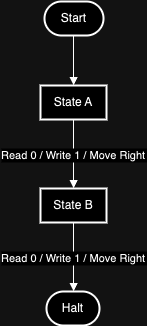

Welcome to the first post in my three-part series on one of the most fascinating problems in all of mathematics and computer science: the **Busy Beaver Problem**.

Before getting into Busy Beavers though, I want to start with the surprisingly simple idea that makes it all possible: the **Turing Machine**. Trust me, you need this foundation — it makes the weirdness that follows much more satisfying.

* * *

## Imagine the Simplest Robot You Can

Picture a tiny robot crawling along an endless strip of paper.

This little machine can do exactly four things:

- Look at the square it's currently sitting on.
- Write a mark (`0` or `1`) on that square.
- Move one step left or right.
- Change its internal "mood," or **state**.

No memory beyond where it's standing. No cleverness. Just a strict set of rules, followed one step at a time.

That's a **Turing Machine**, invented by [Alan Turing](https://www.cs.virginia.edu/~robins/Turing_Paper_1936.pdf) in 1936. And here's the wild part: every laptop, phone, and server running today is just an extremely complicated version of this.

* * *

## What Actually Makes a Turing Machine?

A Turing Machine has a few simple parts:

- **A tape**: An infinite row of squares, each holding a `0` or `1`.
- **A head**: The thing that reads and writes symbols on the tape.
- **A finite set of states**: Think of them like the machine's moods.
- **Transition rules**: Instructions like "if you're in state A and you see a `0`, write a `1`, move right, and switch to state B."

At each step, it reads the symbol underneath it, writes a new symbol, moves left or right, and either switches to a new state or halts.

Simple to describe. Surprisingly hard to reason about, as we'll see.

* * *

## When Does It Halt?

Sometimes a Turing Machine reaches a point where its rules don't tell it what to do next. When that happens, it **halts** — stops writing, stops moving, done.

Halting matters because it marks the end of a computation. And Alan Turing proved something uncomfortable in his famous [Halting Problem](https://en.wikipedia.org/wiki/Halting_problem): **there's no universal way to tell whether a machine will halt or run forever**. You just have to watch and find out. You can't reason your way to an answer in general.

That result is going to matter a lot in Part 2.

* * *

## A Tiny Turing Machine in Action

Let me show you a two-state machine so you can see how this actually works:

<figure>

| Current State | Read Symbol | Write Symbol | Move | Next State |
| --- | --- | --- | --- | --- |
| A | 0 | 1 | R | B |
| B | 0 | 1 | R | HALT |

<figcaption>

Two State Turing Machine

</figcaption>

</figure>



Here's what happens step by step:

1. Machine starts in **state A**, sitting over a blank cell (`0`).
2. It writes a `1`, moves right, switches to **state B**.
3. In **state B**, it finds another blank (`0`).
4. It writes a `1`, moves right.
5. No rules apply anymore, so it **halts**.

**Result:** Two `1`s written side by side, then it stops.

```
Initial Tape: [ 0 ][ 0 ][ 0 ]...

Step 1: (State A)
- Write 1, move right, switch to State B

Tape: [ 1 ][ 0 ][ 0 ]...

Step 2: (State B)
- Write 1, move right, halt

Final Tape: [ 1 ][ 1 ][ 0 ]...
```

Tiny, but you can already see how the rules produce meaningful output.

* * *

## What Does "Size" Mean Here?

One more concept before we get to Busy Beavers: when I talk about the **size** of a Turing Machine, I mean how many states it has (not counting the halting state).

The machine above had two states: A and B. Add a third state and suddenly things get considerably more complex. A slight increase in states leads to a combinatorial explosion in possible behaviors, which is exactly why the Busy Beaver problem is so brutal.

* * *

## The First Glimpse of the Busy Beaver

Here's the question that kicks everything off:

> **Among all possible Turing Machines with a given number of states, which one writes the most 1s before halting?**

This is the [Busy Beaver Problem](https://en.wikipedia.org/wiki/Busy_beaver), introduced by mathematician [Tibor Radó](https://link.springer.com/article/10.1007/BF01386390) in 1962. It sounds almost playful. It is not.

Even with just 4 or 5 states, finding the "busiest" machine becomes genuinely hard. The number of steps and 1s produced can grow faster than any computable function, which means no algorithm can calculate the answer for large numbers of states. Ever.

Simple machines. Infinite complexity.

* * *

## What's Coming Next

In **Part 2**, I'll get into the Busy Beaver Problem properly: how it's formally defined, why tiny machines can produce outputs so large they're hard to comprehend, and some legendary Busy Beaver examples that honestly still kind of break my brain.

It only gets wilder from here.
