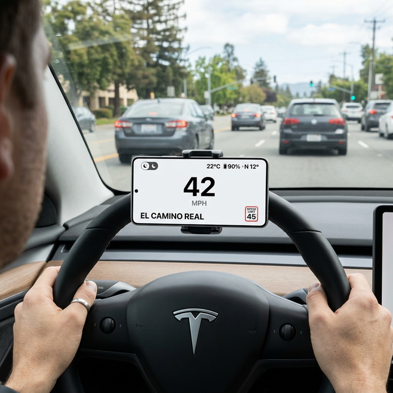
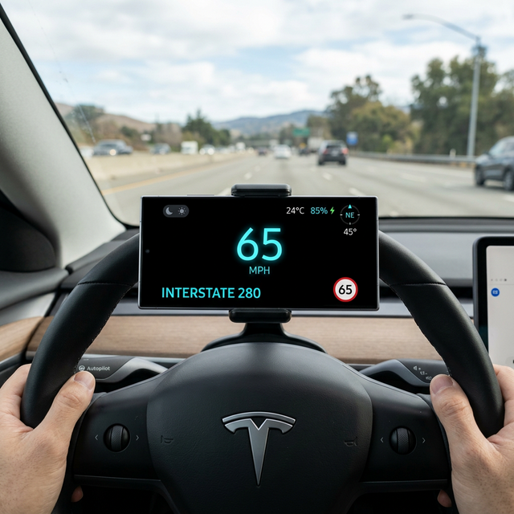

 
Here's something that used to bother me every time I drove. Whenever I wanted to check my speed, see what road I was on, or find out the speed limit, I had to take my eyes off the road and look down at my phone screen. It sounds small, but it happens constantly, and every time you look away, even for a second, it's a risk. That frustration is what pushed me to build this.
 
I had an old Android phone sitting in a drawer doing nothing, and I thought, why not mount it on the dashboard and turn it into a proper heads-up display? Something that puts all the info I need right in front of me, easy to glance at without looking away from the road. I called it the Tesla Heads-Up Display, because the design is inspired by Tesla's minimal, no-clutter UI.
 
Here's how it looks in day mode and night mode:
 

 

 
Pretty clean, right? Let me walk you through how the whole thing works.
 
## What It Actually Does
 
At the core, it's a fullscreen Android app that shows:
 
- Your current speed in MPH
- The speed limit for the road you're on
- The name of the road
- Your phone's battery percentage (and whether it's charging)
- The compass direction you're heading
- The ambient temperature from the battery sensor
 
If you go over the speed limit, it highlights in orange. Go more than 10 MPH over, and it turns red and shows a "SLOW DOWN" message, plus plays a beep. It's a safety feature I actually find useful.
 
## The Tech Stack
 
I built this with Kotlin and Jetpack Compose. If you're an Android developer, Compose is really the way to go for UI these days. It's declarative, which means you describe what the screen should look like based on state, and Compose handles the rest. No more XML layouts.
 
Here's a quick overview of what I used:
 
- **Jetpack Compose** for the UI
- **FusedLocationProviderClient** for GPS speed
- **Google Roads API** for speed limit data
- **Google Geocoding API** for road names
- **Room Database** for caching road data locally
- **SensorManager** for the ambient light sensor
- **OkHttp** for network calls
 
## Getting the Speed Right
 
Getting the speed was actually the easy part. Android's `FusedLocationProviderClient` gives you location updates, and each update includes the speed in meters per second. I just multiply by `2.23694` to convert to MPH and update the UI.
 
```kotlin
val speedMph = location.speed * 2.23694f
```
 
I set it to update every 500 milliseconds, which feels responsive without draining too much battery.
 
## The Hard Part: Speed Limits
 
Getting speed limits is trickier. There's no magic API that just tells you the speed limit anywhere. I ended up using Google's Roads API, which takes GPS coordinates and returns the nearest road along with the posted speed limit. Works surprisingly well on highways and most major roads.
 
But here's the thing: I can't call the API every half second. That would burn through the free quota fast and also just waste data. So I built a throttling system that adjusts how often it calls the API based on how fast I'm going.
 
- Under 20 MPH (stopped or slow traffic): wait at least 30 seconds between calls
- Between 20 and 50 MPH: call every 15 seconds
- Over 50 MPH (highway): call every 10 seconds
 
I also cache the results in a local Room database. So if you drive the same road again, it can just pull from the cache instead of hitting the API.
 
## Auto Dark and Light Mode
 
I wanted the display to automatically switch between dark and light mode based on the actual lighting around me, not just the time of day. I use the phone's ambient light sensor for this.
 
The logic is simple: if the lux level drops below 10, switch to dark mode. If it goes above 20, switch to light mode. The gap between those numbers prevents it from flickering when you're in mixed lighting.
 
You can also manually toggle it with a button if you want.
 
## It Launches Automatically When I Get in the Car
 
This is my favorite part. I added a Bluetooth receiver that listens for when my phone connects to my car's Bluetooth. When it detects the connection, it automatically launches the HUD app. So I just get in the car, and it's already running.
 
```kotlin
if (device.name == "Chai's Tesla") {
    // launch the app
}
```
 
Yes, I hardcoded the car name. It works for me.
 
## The UI
 
Everything is built with Jetpack Compose. The speed is shown in a big, easy-to-read number in the center. Speed limit gets its own little circular sign to the side, styled to look like an actual US speed limit sign. The road name sits at the top.
 
The color scheme changes based on mode. Dark mode uses deep navy and white text, light mode flips to a light gray background with dark text. Both are designed to be readable at a glance, which is the whole point.
 
## What I Would Do Differently
 
If I were starting over, I'd probably not hardcode my car's Bluetooth name and instead add a settings screen where you can pick your device. I'd also explore using the HERE or TomTom APIs for speed limits since Google's Roads API doesn't have great coverage in some areas.
 
Also, Room migrations. I didn't set those up properly at first and had to nuke the database a couple times during development. Don't be me.
 
## Try It Yourself
 
The full source is on GitHub: [chaitupendyala/teslaheadsupdisplay](https://github.com/chaitupendyala/teslaheadsupdisplay)
 
You'll need a Google Maps API key with the Roads API and Geocoding API enabled. Add your key to `local.properties`, build, and you're good to go. Mount your phone on the dashboard, and you've got yourself a HUD.
 
It's one of those projects that I use every single day now, which is rare for side projects. If you drive a lot and like having clean data in front of you, give it a try.